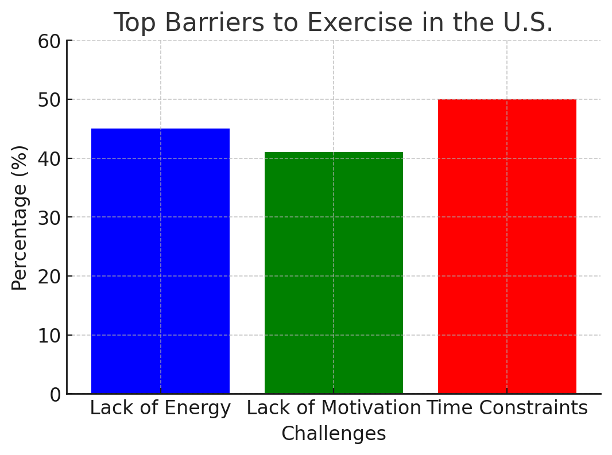
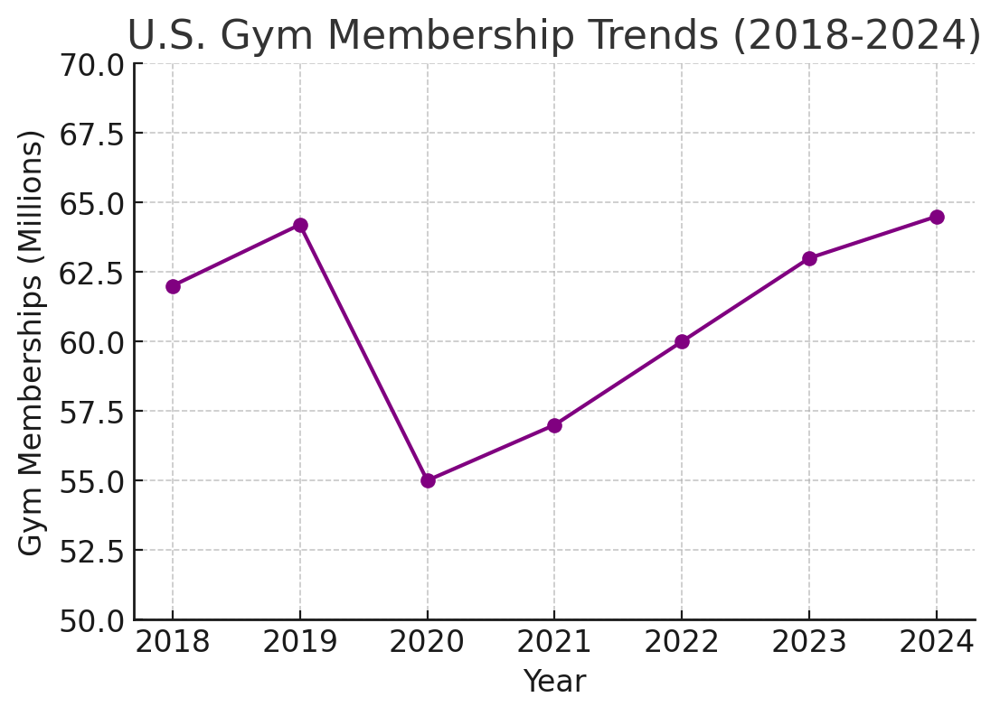
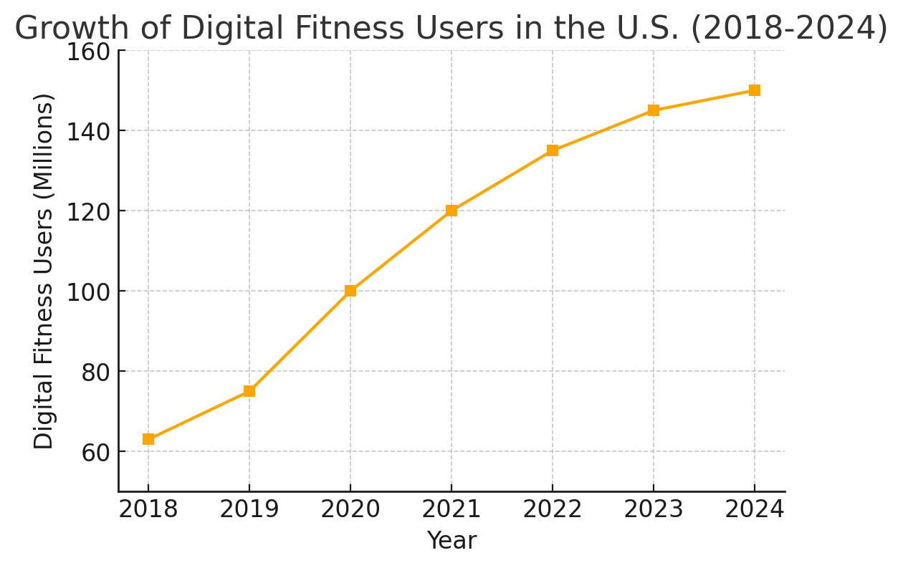

**Title:** Market Analysis of the U.S. Fitness Industry

**Author:** Weijing Lin, Ativafit

**Abstract:**

The U.S. fitness industry is undergoing significant transformations, influenced by shifts in consumer behavior, advancements in fitness technology, and increasing demand for digital fitness solutions. This paper examines the challenges faced by fitness beginners and experienced gym-goers, trends in fitness equipment and training methods, gym membership statistics, digital fitness adoption, and market opportunities. Data from Statista, IBISWorld, IHRSA, and other industry sources are analyzed to provide insights into the industry's current state and future prospects.

**1. Introduction**

The fitness industry in the United States has seen rapid changes over the past decade. Traditional gym memberships have fluctuated due to economic factors and the COVID-19 pandemic, while digital fitness solutions have experienced substantial growth. This paper explores the key trends, challenges, and opportunities within the industry.

**2. Challenges Faced by Fitness Consumers**

2.1 Lack of Motivation and Time Constraints  
- 45% of Americans cite lack of energy as a primary barrier to exercise.
- 50% of beginners quit within six months due to time constraints and low prioritization.

2.2 Cost and Accessibility  
- High gym membership fees remain a deterrent, with 46% of cancellations attributed to cost concerns.
- Home fitness equipment purchases surged during the pandemic, indicating a shift toward affordable and flexible alternatives.

**3. Fitness Equipment and Training Trends**

3.1 Popular Training Methods  
- Yoga, HIIT (High-Intensity Interval Training), and bodyweight exercises remain dominant training styles.
- Hybrid workout models combining in-person and digital experiences are on the rise.

3.2 Fitness Equipment Trends  
- Treadmills, resistance machines, and free weights are the most widely used gym equipment.
- The U.S. home fitness market grew by 68.3% from 2010 to 2020, with sales of free weights increasing by 104% in 2020 alone.

**4. Gym Membership and Digital Fitness Trends**

4.1 Gym Membership Data  
- As of 2024, the U.S. gym industry is valued at $41.8 billion.
- Approximately 24% of the U.S. population holds a gym membership, though retention remains a challenge.

4.2 Digital Fitness Adoption  
- The number of digital fitness users grew from 63 million in 2018 to 145 million in 2023.
- The U.S. digital fitness market is projected to reach $20.87 billion in 2024.
- Popular digital fitness services include mobile fitness apps, wearable tracking, and virtual coaching.

**5. Market Opportunities and Future Outlook**

- The rise of hybrid fitness models integrating in-person training with digital platforms presents growth opportunities.
- Senior fitness, women-specific programs, and personalized AI-driven training solutions are emerging market segments.
- Smart fitness technology, including AI-powered coaching and connected home gym systems, will shape the industry's future.

**6. Conclusion**

The U.S. fitness industry is undergoing a paradigm shift, with digital fitness and home workout solutions gaining traction. Understanding consumer behavior, retention challenges, and emerging fitness trends will be critical for businesses seeking to capitalize on this evolving market.

**7. References**

1. Statista - U.S. Exercise Barriers
2. American Heart Association - Making Time for Exercise
3. IHRSA - Fitness Industry Research
4. IBISWorld - U.S. Gym & Fitness Industry Report
5. NPD Group - Home Fitness Boom
6. Statista - Digital Fitness Market Size
7. Statista - U.S. Gym Membership Expenditure
8. Statista - U.S. Gym Membership Fees
9. Statista - U.S. Fitness App Users

